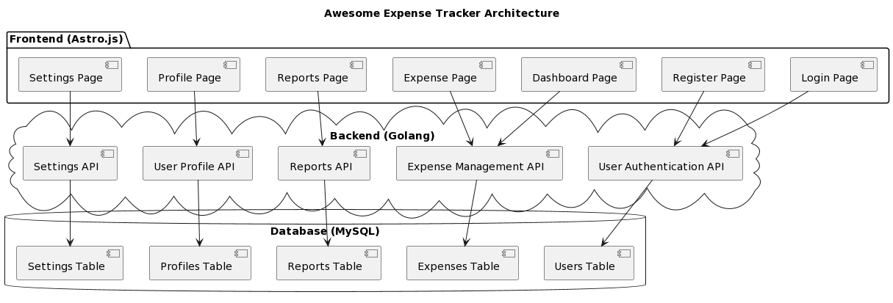

# Awesome Expense Tracker

## Project Overview

The Awesome Expense Tracker is a web application designed to make tracking personal finances easier. It provides a detailed overview of expenditure and helps users pinpoint areas for improvement.

## Technology Stack

- **Frontend**: Astro.js
- **Backend**: Golang
- **Database**: MySQL

## Architecture Overview

## Features

### User Authentication

Users should be able to register, login, and logout of the application.

### Expense Tracking

Users should be able to add, edit, and delete expenses. Each expense should have details like amount, date, category, and a brief description.

### Expense Categorization

Expenses should be categorized (e.g., groceries, utilities, entertainment, etc.) to help users understand where their money is going.

### Budgeting

Users should be able to set monthly budgets for different categories and track their spending against these budgets.

### Reporting

The application should provide detailed reports of expenditure. This could include monthly spending summaries, category-wise spending breakdowns, and trend analysis over time.

### Dashboard

A user-friendly dashboard that provides a quick overview of the user's financial status, including total expenses, budget status, and spending trends.

## Development Plan

1. **Set up the development environment**: Install Astro.js, Golang, MySQL, and any other necessary dependencies.

2. **Design the application architecture**: Plan out the structure of your frontend and backend, and how they will interact with each other and the database.

3. **Develop the backend APIs**: Use Golang to create RESTful APIs for handling user authentication, managing expenses, and generating reports.

4. **Set up the MySQL database**: Design the database schema and set up the necessary tables for storing user and expense data.

5. **Develop the frontend**: Use Astro.js to create the user interface. This includes the login/register pages, the dashboard, the expense tracking page, and the reports page.
